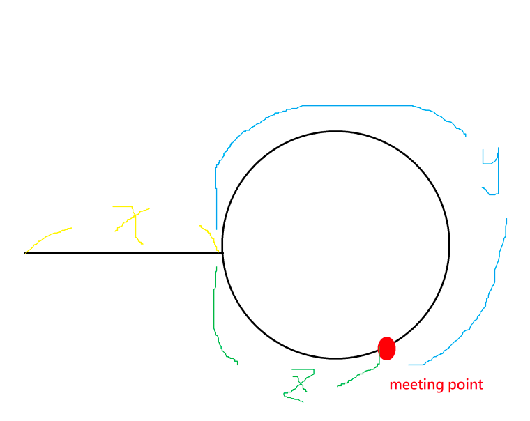

# Two Pointer

## Generalize the characteristics of the problems that can be solved by two pointers

+ If a wider scope of the sliding window is valid, the narrower scope of that wider scope is valid mush hold.
+ If a narrower scope of the sliding window is invalid, the wider scope of that narrower scope is invalid mush hold.

----
## Index

+ [Slide Window technique](#Siding-Windown-technique)
+ [Two Pointer technique](#Two-Pointer-technique)
    + [Duplicated Number](#Find-the-Duplicate-Number)

----

# Siding Windown technique

+ [Sliding Window algorithm template to solve all the Leetcode substring search problem.](https://leetcode.com/problems/find-all-anagrams-in-a-string/discuss/92007/Sliding-Window-algorithm-template-to-solve-all-the-Leetcode-substring-search-problem)

----

# Two Pointer technique

+ ## Find the Duplicate Number

The main idea is the same with problem Linked List Cycle II,https://leetcode.com/problems/linked-list-cycle-ii/. Use two
pointers the fast and the slow. The fast one goes forward two steps each time, while the slow one goes only step each
time. They must meet the same item when slow==fast. In fact, they meet in a circle, the duplicate number must be the
entry point of the circle when visiting the array from nums[0]. Next we just need to find the entry point. We use a
point(we can use the fast one before) to visit form begining with one step each time, do the same job to slow. When
fast==slow, they meet at the entry point of the circle. The easy understood code is as follows.

```c++
int findDuplicate3(vector<int>& nums)
{
	if (nums.size() > 1)
	{
		int slow = nums[0];
		int fast = nums[nums[0]];
		while (slow != fast)
		{
			slow = nums[slow];
			fast = nums[nums[fast]];
		}

		fast = 0;
		while (fast != slow)
		{
			fast = nums[fast];
			slow = nums[slow];
		}
		return slow;
	}
	return -1;
}
```

If there is no duplicate in the array, we can map each indexes to each numbers in this array. In other words, we can
have a mapping function f(index) = number For example, let's assume nums = [2,1,3], then the mapping function is 0->2,
1->1, 2->3. If we start from index = 0, we can get a value according to this mapping function, and then we use this
value as a new index and, again, we can get the other new value according to this new index. We repeat this process
until the index exceeds the array. Actually, by doing so, we can get a sequence. Using the above example again, the
sequence we get is 0->2->3. (Because index=3 exceeds the array's size, the sequence terminates!)

However, if there is duplicate in the array, the mapping function is many-to-one. For example, let's assume nums
= [2,1,3,1], then the mapping function is 0->2, {1,3}->1, 2->3. Then the sequence we get definitely has a cycle. 0->2->
3->1->1->1->1->1->........ The starting point of this cycle is the duplicate number. We can use Floyd's Tortoise and
Hare Algorithm to find the starting point.

According to Floyd's algorithm, first step, if a cycle does exist, and you advance the tortoise one node each unit of
time but the hare two nodes each unit of time, then they will eventually meet. This is what the first while loop does.
The first while loop finds their meeting point.

*Second step, take tortoise or hare to the start point of the list (i.e. let one of the animal be 0) and keep the other
one staying at the meeting point. Now, advance both of the animals one node each unit of time, the meeting point is the
starting point of the cycle. This is what the second while loop does. The second while loop finds their meeting point.

*Proof of second step:

Distance traveled by tortoise while meeting = x + y

Distance traveled by hare while meeting = (x + y + z) + y = x + 2y + z

Since hare travels with double the speed of tortoise,

so 2(x+y)= x+2y+z => x+2y+z = 2x+2y => x=z

Hence by moving tortoise to start of linked list, and making both animals to move one node at a time, they both have
same distance to cover .

They will reach at the point where the loop starts in the linked list
